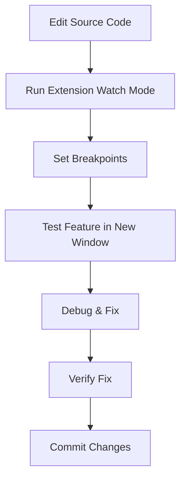
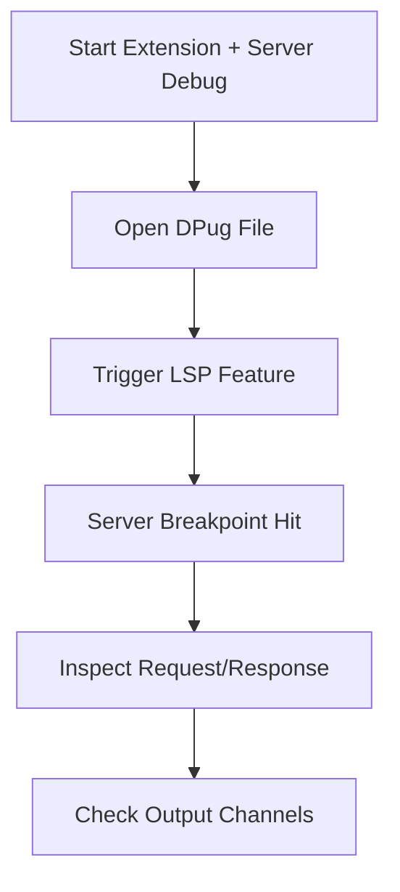
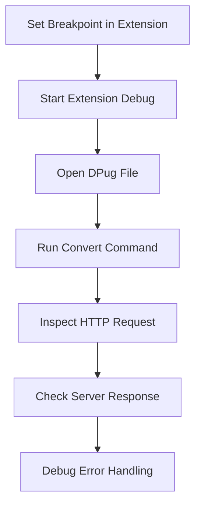

# DPug VS Code Extension - Advanced Debugging Guide

This guide provides detailed debugging workflows for the DPug VS Code extension, covering both development and troubleshooting scenarios.

## Table of Contents

- [Quick Start](#quick-start)
- [Debug Configurations](#debug-configurations)
- [Debugging Workflows](#debugging-workflows)
- [Language Server Debugging](#language-server-debugging)
- [Extension Host Debugging](#extension-host-debugging)
- [Network Debugging](#network-debugging)
- [Performance Debugging](#performance-debugging)
- [Troubleshooting](#troubleshooting)

## Quick Start

### Prerequisites

1. **DPug Server**: The extension will automatically start the DPug server, but you can also run it manually:

   ```bash
   cd ../dpug_server
   dart run bin/server.dart --port 8080
   # Or use dpug_cli
   dpug server start --port 8080
   ```

2. **Dependencies Installed**:

   ```bash
   cd vscode_extension
   bun install
   ```

3. **Extension Compiled**:
   ```bash
   bun run compile
   ```

### Basic Debug Session

1. Open `vscode_extension` folder in VS Code
2. Press F5 or use Run & Debug panel (Ctrl+Shift+D)
3. Select "Run Extension" configuration
4. A new VS Code window opens with the extension loaded
5. Open a `.dpug` file to test features

## Debug Configurations

### Extension Host Configurations

| Configuration                  | Purpose                             | When to Use                              |
| ------------------------------ | ----------------------------------- | ---------------------------------------- |
| **Run Extension**              | Standard debugging with compilation | First-time debugging, stable development |
| **Run Extension (Watch Mode)** | Debugging with auto-recompilation   | Active development with frequent changes |
| **Attach to Extension Host**   | Attach to running extension         | Debugging existing extension instances   |

### Language Server Configurations

| Configuration                  | Purpose            | When to Use                            |
| ------------------------------ | ------------------ | -------------------------------------- |
| **Debug Language Server**      | Debug LSP features | Testing completion, hover, diagnostics |
| **Debug Extension and Server** | Combined debugging | Full-stack debugging scenarios         |

### Compound Configurations

| Configuration                | Purpose        | Components                  |
| ---------------------------- | -------------- | --------------------------- |
| **Debug Extension + Server** | Full debugging | Extension + Language Server |

## Debugging Workflows

### 1. Feature Development Workflow



**Steps:**

1. Set breakpoints in source files
2. Use "Run Extension (Watch Mode)" for auto-recompilation
3. Test features in the new VS Code window
4. Use Debug Console for logging and inspection

### 2. Language Server Protocol Workflow



**Steps:**

1. Use compound configuration "Debug Extension + Server"
2. Monitor "DPug Language Server" output channel
3. Set breakpoints in `dpug-language-server.ts`
4. Test LSP features (completion, hover, etc.)

### 3. Conversion Debugging Workflow



**Steps:**

1. Set breakpoints in `formatDocument` or `convertToDart` functions
2. Use "Run Extension" configuration
3. Monitor network requests in Debug Console
4. Check error handling for server communication

## Language Server Debugging

### LSP Protocol Debugging

The language server implements these LSP features:

- **Completion**: `onCompletion` handler
- **Hover**: `onHover` handler
- **Diagnostics**: `validateTextDocument` function
- **Signature Help**: `onSignatureHelp` handler
- **Definition**: `onDefinition` handler
- **References**: `onReferences` handler
- **Document Symbols**: `onDocumentSymbol` handler

### Setting LSP Breakpoints

```typescript
// In dpug-language-server.ts
connection.onCompletion((_textDocumentPosition) => {
  // Set breakpoint here for completion debugging
  return [...]; // Your completion items
});

connection.onHover((params) => {
  // Set breakpoint here for hover debugging
  const word = getWordAtPosition(document, params.position);
  return { contents: { kind: 'markdown', value: info } };
});
```

### Debugging Tips

1. **Output Channel**: Monitor "DPug Language Server" output
2. **Debug Console**: Check server initialization logs
3. **Network Tab**: Inspect LSP message flow (if available)
4. **Port 6009**: Language server debug port

## Extension Host Debugging

### Extension Lifecycle

```typescript
// Extension activation - set breakpoint here
export function activate(context: vscode.ExtensionContext) {
  // Debug extension setup
}

// Command execution - set breakpoints here
const formatCommand = vscode.commands.registerCommand(
  "dpug.formatDocument",
  formatCurrentDocument // Debug this function
);
```

### Debugging Commands

**Format Command** (`dpug.formatDocument`):

- Set breakpoint in `formatCurrentDocument`
- Debug document retrieval and formatting logic
- Inspect HTTP request to DPug server

**Convert Commands** (`dpug.toDart`, `dpug.fromDart`):

- Set breakpoint in `convertToDart` or `convertFromDart`
- Debug conversion logic and error handling
- Monitor document creation and display

### Extension Context

```typescript
export function activate(context: vscode.ExtensionContext) {
  // Debug context properties
  console.log("Extension path:", context.extensionPath);
  console.log("Global state:", context.globalState);
  console.log("Workspace state:", context.workspaceState);
}
```

## Network Debugging

### HTTP Server Communication

The extension communicates with the DPug HTTP server for:

- **Formatting**: `POST /format/dpug`
- **DPug to Dart**: `POST /dpug/to-dart`
- **Dart to DPug**: `POST /dart/to-dpug`
- **Health Check**: `GET /health`

### Debugging Network Requests

```typescript
// In extension.ts - formatDocument function
const response = await axios.post(
  `http://${serverHost}:${serverPort}/format/dpug`,
  document.getText(),
  {
    headers: { "Content-Type": "text/plain" },
  }
);

// Add debugging
console.log("Request URL:", `http://${serverHost}:${serverPort}/format/dpug`);
console.log("Request body:", document.getText());
console.log("Response:", response.data);
```

### Server Configuration

Debug server settings in VS Code:

```json
{
  "dpug.server.host": "localhost",
  "dpug.server.port": 8080
}
```

## Performance Debugging

### Extension Performance

1. **Activation Time**: Debug `activate` function performance
2. **Command Execution**: Time command execution with breakpoints
3. **Memory Usage**: Monitor extension memory in Debug Console

### Language Server Performance

1. **Initialization**: Debug server startup time
2. **Document Sync**: Monitor incremental vs full document sync
3. **Validation**: Profile `validateTextDocument` performance

### Performance Tips

```typescript
// Add timing to commands
async function formatDocument(document: vscode.TextDocument) {
  const startTime = Date.now();

  // ... formatting logic ...

  const endTime = Date.now();
  console.log(`Formatting took ${endTime - startTime}ms`);
}
```

## Troubleshooting

### Common Issues

#### Extension Not Loading

**Symptoms:**

- Extension commands not available
- No DPug language support in `.dpug` files

**Debug Steps:**

1. Check VS Code extension logs
2. Verify compilation completed successfully
3. Check `activationEvents` in `package.json`
4. Test with simple `.dpug` file

#### Language Server Not Starting

**Symptoms:**

- No language features (completion, hover)
- "DPug Language Server" output channel empty

**Debug Steps:**

1. Check compilation of server code
2. Verify `dpug-language-server.js` exists in `out/server/`

#### Server Auto-Start Issues

**Symptoms:**

- Extension activates but server doesn't start automatically
- Features fail with "Connection refused" or timeout errors
- Manual server commands work but automatic startup fails

**Debug Steps:**

1. Check "DPug" output channel for server startup logs
2. Verify `dpug.server.autoStart` setting is `true` (default)
3. Ensure `dpug_cli` executable is available:
   - Check if `dpug` is in PATH
   - Or verify `dpug_cli/bin/dpug.dart` exists in workspace
4. Check if configured server port is available
5. Try manual server start with "DPug: Start Server" command
6. Verify server configuration matches:
   ```json
   {
     "dpug.server.host": "localhost",
     "dpug.server.port": 8080
   }
   ```
7. Check port 6009 availability
8. Debug server initialization in `activateLanguageServer`

#### Breakpoints Not Working

**Symptoms:**

- Breakpoints show as unbound
- Code execution doesn't pause

**Debug Steps:**

1. Verify source maps generated (`*.js.map` files)
2. Check TypeScript compilation output
3. Ensure debugging correct file (source vs compiled)
4. Try "Restart" in debug panel

#### Server Connection Failed

**Symptoms:**

- Formatting/conversion commands fail
- Error: "Connection refused" or similar

**Debug Steps:**

1. Verify DPug server is running
2. Check server host/port configuration
3. Test server directly: `curl http://localhost:8080/health`
4. Debug HTTP request in extension code

### Debug Checklist

- [ ] Extension compiled successfully
- [ ] Source maps generated in `out/` directory
- [ ] DPug HTTP server running on configured port
- [ ] Language server port 6009 available
- [ ] Extension host port 9229 available (for attach scenarios)
- [ ] TypeScript source files match compiled JavaScript
- [ ] Breakpoints set in source files, not compiled files

### Getting Help

1. **Output Channels**: Check "DPug" and "DPug Language Server" channels
2. **Debug Console**: Use `console.log` for debugging
3. **Network**: Monitor HTTP requests to DPug server
4. **VS Code Logs**: Check extension host logs

### Advanced Debugging

#### Using Chrome DevTools

1. Start extension with `--inspect` flag
2. Open Chrome and navigate to `chrome://inspect`
3. Click "Open dedicated DevTools for Node"
4. Set breakpoints and debug

#### Remote Debugging

For debugging on different machines:

1. Set `"debug.javascript.autoAttachFilter": "onlyWithFlag"`
2. Use `--inspect-brk` for initial break
3. Configure port forwarding if needed

#### Profiling

1. Use VS Code's built-in profiler
2. Profile extension activation and command execution
3. Analyze performance bottlenecks

## Contributing

When debugging issues, please include:

- VS Code version and OS
- Extension version
- Steps to reproduce
- Debug console output
- Output channel logs
- Network request/response details
